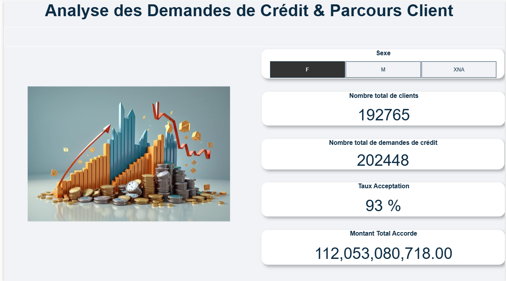
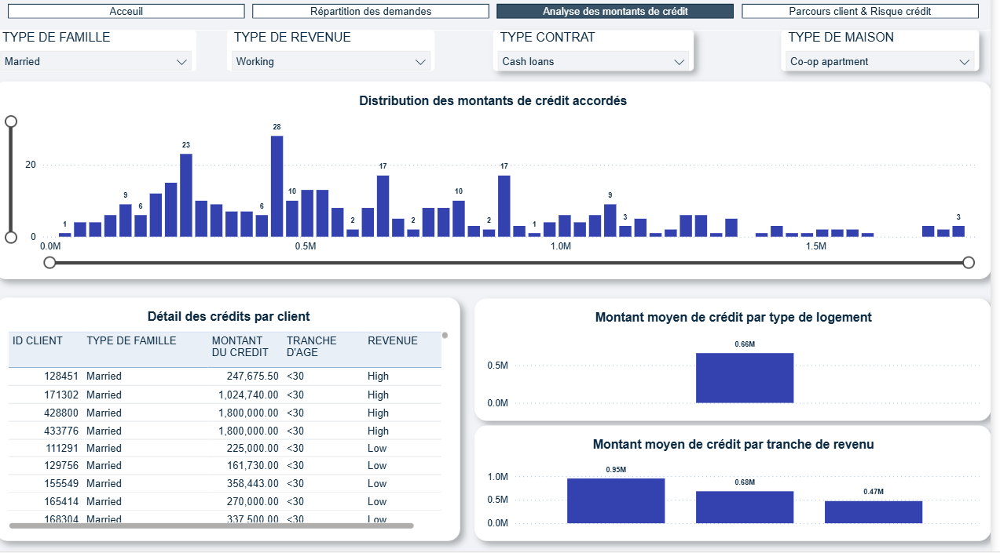

# 📊 Dashboard Power BI — Analyse Crédit Bancaire

Bienvenue sur ce projet Power BI qui présente une analyse complète des demandes de crédit et du parcours client d’une banque.

Nom :TENUDA-EKLOU Afi 
Contact:afitenuda@gmail.com    
Linkden : https://www.linkedin.com/in/afi-tenuda-eklou-832101219/
---

## 🎥 Démo vidéo

[▶️ Voir la démonstration du dashboard](video_demo.mp4)

---

## 📁 Contenu du dépôt

- `rapport_credit_bancaire.pbix` : Le rapport Power BI interactif (4 pages)
- les datasets : https://www.kaggle.com/datasets/sabarostami/risk-analytics-in-banking

## 🖥️ Présentation du dashboard

Ce rapport Power BI comprend :

### 1️⃣ **Page d’Accueil**
- Les KPIs essentiels : nombre de clients, demandes, taux d’acceptation, montant total accordé
- Filtrage dynamique (ex : par sexe)
- 

### 2️⃣ **Répartition des demandes**
- Segmentation clients : sexe, tranche de revenu, statut familial, tranche d’âge, possession voiture/immobilier

### 3️⃣ **Analyse des montants de crédit**
- Distribution et analyse des montants accordés
- Montant moyen par logement, par tranche de revenu
- Détail par client
- 

### 4️⃣ **Parcours client & Risque crédit**
- Taux de refus par type de contrat/âge
- Scoring de risque crédit (faible, modéré, élevé)
- Fidélité client (nombre de crédits antérieurs)
- Détail et scoring individuels

---

## ⚙️ Utilisation

1. Télécharge le fichier `.pbix`
2. Ouvre-le avec [Power BI Desktop](https://powerbi.microsoft.com/fr-fr/desktop/)
3. Navigue parmi les pages et utilise les filtres pour explorer les segments

---

